# Animación de físicas
## Agustín Alfonso González Iríbar
Animación y minijuego de física realizados con __Three.js__ y __Ammo.js__.

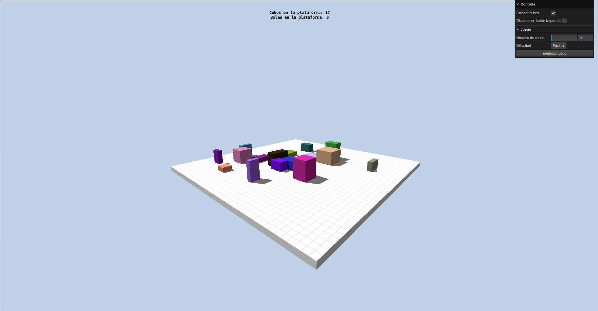


## Ejecución del proyecto en local

A continuación, se detallan las instrucciones de ejecución del proyecto de forma local en caso de que la version web fallara.

1. Descargar o clonar el repositorio

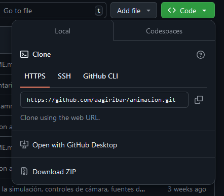

2. Descargar e instalar la version mas reciente de ``Node.js`` desde [este enlace](https://nodejs.org/en)

3. Para asegurar que la instalación se realizó correctamente utilizar los siguientes comandos en un terminal o símbolo del sistema:

```
node --version
npm --version
```

4. Una vez correctamente instalado ejecutar el siguiente comando desde un terminal o símbolo del sistema en el directorio o carpeta en el que se encuentre el proyecto:

```
npm install
```

5. Una vez termine el comando anterior ejecutar el siguiente comando desde el mismo terminal o simbolo del sístema:

```
npm run start
```

6. Una vez ejecutado este comando se observará en la consola algo parecido a esto:
```
> animacion-agustin@1.1.0 start
> node server.js

Your app is listening on port 1234
http://localhost:1234
```

7. Abrir un navegador y, en la barra de direcciones, escribir ```localhost:1234``` sustituyendo el 3000 por el número indicado anteriormente.

8. Para terminar la simulación, pulsar la combinación de botones ```Ctrl + C``` en la consola donde se realizó el paso 5

## Estructura del proyecto

La estructura de los archivos del código fuente del proyecto, en el directorio ```src``` es la siguiente:

- Directorio ```modules```: Incluye módulos que se encargan de realizar distintas partes de la aplicación:
    
    - ```game.js```: Se encarga de la gestión de la lógica de juego.

    - ```gameObjects.js```: Se encarga de la creación de los objetos de la simulación (suelo, cubos y bolas).

    - ```gui.js```: Se encarga de la creación de la interfaz de usuario.

    - ```input.js```: Se encarga de la creación y la lógica de los elementos de interacción de la simulación (raycaster e interacciones al hacer clic).

    - ```simObjects.js```: Se encarga de la creación de los objetos de la simulación (escena, cámara, renderer, control órbital y reloj).

    - ```world.js```: Se encarga de la creación del mundo físico con __Ammo.js__.

- ```animacion.js```: Inicializa __Ammo.js__, inicializa la simulación y controla el bucle de animación.

- ```index.html```: Fichero __HTML__ en el que se muestra la simulación.

## Controles de la simulación
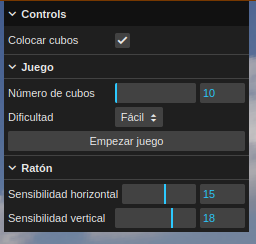

La simulación incluye dos ``modos de funcionamiento``:
1. Un modo que permite colocar cubos y lanzar bolas con total libertad.
2. Un minijuego consistente en colocar un número determinado de cubos para, posteriormente, tirarlos de la plataforma utilizando un número determinado de bolas.

### Control de botón de colocación o disparo

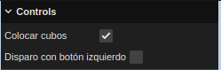

La interfaz de usuario ofrece la opción de disparar o colocar cubos (según el modo seleccionado en el selector ``Colocar cubos``) con los dos botones del ratón (marcando el selector) o solamente con el botón derecho (no marcando el selector) a través del selector ``Disparo con botón izquierdo``.

Esta opción se implementó debido a que el botón de disparo, si esta opción está activada, se activa al mover la cámara, que también se mueve pulsando el botón izquierdo del ratón.

### Modos de funcionamiento de la simulación
#### Colocación de cubos o lanzamiento de bolas

En este modo se permite la colocación de cubos si la opción ``Colocar cubos`` está seleccionada. Para colocar un cubo simplemente basta con pulsar con el ratón el cualquier punto de la plataforma.

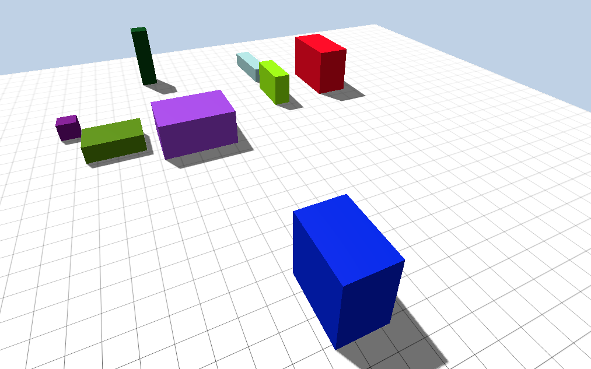

También se permite el lanzamiento de bolas al desactivar la opción ``Colocar cubos``. Para lanzar una bola basta con pulsar con el ratón en cualquier parte de la pantalla.

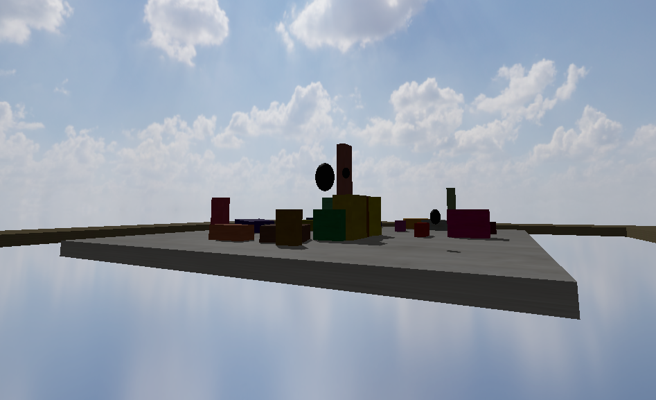

En la parte superior de la pantalla se muestran al usuario el número de cubos y bolas que se encuentran sobre la plataforma.

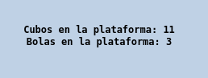

#### Minijuego

La simulación incluye un pequeño minijuego consistente en colocar un determinado número de cubos para, posteriormente, sacarlos de la plataforma utilizando un determinado número de bolas.

##### Inicio del minijuego

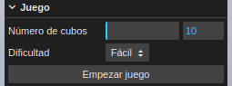

En la interfaz de usuario se puede seleccionar, en primer lugar, el número de cubos que se deberán colocar al empezar.

Si en la plataforma ya se encontraran un número de cubos superior al número de cubos seleccionado, se jugará con el número de cubos presentes en la plataforma. Por ejemplo, si se seleccionan 25 cubos y en la plataforma hubieran 50 cubos, se jugaría con 50 cubos.

Una vez seleccionado el número de cubos se procede a seleccionar la dificultad. Dicha dificultad afecta al número de disparos que el jugador puede efectuar.

Actualmente el número de bolas se selecciona de la siguiente manera:

1. Dificultad ``fácil``: 75 % del número de cubos
2. Dificultad ``normal``: 50 % del número de cubos
3. Dificultad ``dificil``: 33 % del número de cubos

Una vez se han establecido los parámetros del juego, se pulsa el botón ``Empezar juego`` para inicializar el juego.

##### Fase inicial: Colocación de cubos

Si en la plataforma hay menos cubos que los seleccionados por el jugador, entonces deberá colocar los cubos restantes para pasar a la siguiente fase.

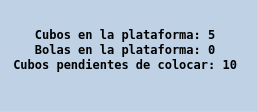

Además, se informa en la parte superior de la pantalla cuantos cubos quedan por colocar.

##### Segunda fase: Lanzamiento de bolas

En esta fase el jugador deberá disparar bolas para expulsar de la plataforma los cubos que colocó previamente.

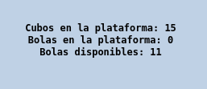

El jugador tendrá un número de disparos limitados determinados por la dificultad y el número de cubos y se le indicaran en la parte superior de la pantalla.

Cuando el jugador expulse todos los cubos, o se quede sin disparos, el juego pasará a la fase final.

##### Fase final: muestra de resultados

En esta fase se indicará al jugador si ha ganado o ha perdido en función de si ha podido expulsar todos los cubos de la plataforma con los disparos que tenía.

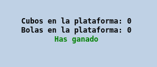


Al finalizar aparece un botón al que permite al usuario finalizar la partida y volver al estado inicial de la simulación, en el que puede empezar otra partida.

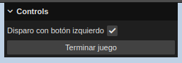