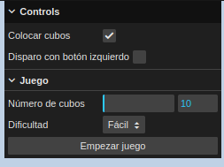
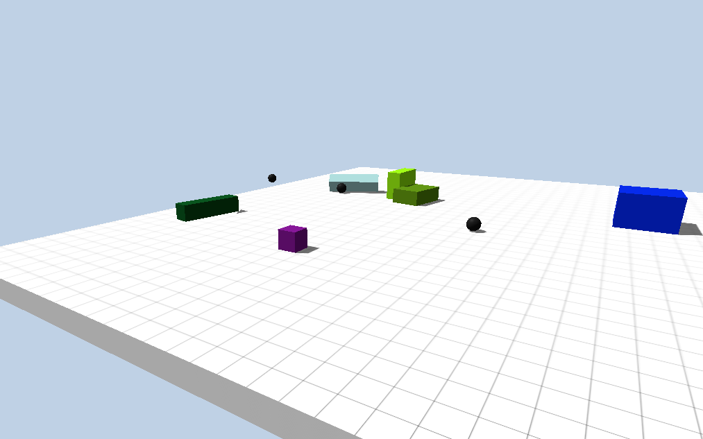
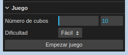

# Animación de físicas
## Agustín Alfonso González Iríbar
Animación y minijuego de física realizados con _three.js_ y _Ammo_.

## Controles de la simulación

La simulación incluye dos ``modos de funcionamiento``:
1. Un modo que permite colocar cubos y lanzar bolas con total libertad.
2. Un minijuego consistente en colocar un número determinado de cubos para, posteriormente, tirarlos de la plataforma utilizando un número determinado de bolas.

### Control de botón de colocación disparo

La interfaz de usuario ofrece la opción de disparar o colocar cubos (según el modo seleccionado en el selector ``Colocar cubos``) con los dos botones del ratón (marcando el selector) o solamente con el botón derecho (no marcando el selector) a través del selector ``Disparo con botón izquierdo``.

Esta opción se implementó debido a que el botón de disparo, si esta opción está activada, se activa al mover la cámara, que también se mueve pulsando el botón izquierdo del ratón.

### Modos de funcionamiento de la simulación
#### Colocación de cubos o lanzamiento de bolas

En este modo se permite la colocación de cubos si la opción ``Colocar cubos`` está seleccionada. Para colocar un cubo simplemente basta con pulsar con el ratón el cualquier punto de la plataforma.

También se permite el lanzamiento de bolas al desactivar la opción ``Colocar cubos``. Para lanzar una bola basta con pulsar con el ratón en cualquier parte de la pantalla.

En la parte superior de la pantalla se muestran al usuario el número de cubos y bolas que se encuentran sobre la plataforma.

#### Minijuego

La simulación incluye un pequeño minijuego consistente en colocar un determinado número de cubos para, posteriormente, sacarlos de la plataforma utilizando un determinado número de bolas.

##### Inicio del minijuego

En la interfaz de usuario se puede seleccionar, en primer lugar, el número de cubos que se deberán colocar al empezar.

Si en la plataforma ya se encontraran un número de cubos superior al número de cubos seleccionado, se jugará con el número de cubos presentes en la plataforma. Por ejemplo, si seleccionan 25 cubos y en la plataforma hubieran 50 cubos, se jugaría con 50 cubos.

Una vez seleccionado el número de cubos se procede a seleccionar la dificultad. Dicha dificultad afecta al número de disparos que el jugador puede efectuar.

Actualmente el número de bolas se selecciona de la siguiente manera:

1. Dificultad ``fácil``: 75 % del número de cubos
2. Dificultad ``normal``: 50 % del número de cubos
3. Dificultad ``dificil``: 33 % del número de cubos

Una vez se han establecido los parámetros del juego, se pulsa el botón ``Empezar juego`` para inicializar el juego.

##### Fase inicial: Colocación de cubos

Si en la plataforma hay menos cubos que los seleccionados por el jugador, entonces este deberá colocar los cubos restantes para pasar a la siguiente fase.

Además, se informa en la parte superior de la pantalla cuantos cubos le quedan por colocar.

##### Segunda fase: Lanzamiento de bolas

En esta fase el jugador deberá disparar bolas para expulsar de la plataforma los cubos que colocó previamente.

El jugador tendrá un número de disparos limitados determinados por la dificultad y el número de cubos y se le indicaran en la parte superior de la pantalla.

Cuando el jugador expulse todos los cubos, o se quede sin disparos, el juego pasará a la fase final.

##### Fase final: muestra de resultados

En esta fase se indicará al jugador si ha ganado o ha perdido en función de si ha podido expulsar todos los cubos de la plataforma con los disparos que tenía.

Al finalizar aparece un botón al que permite al usuario finalizar la partida y volver al estado inicial de la simulación, en el que puede empezar otra partida.

